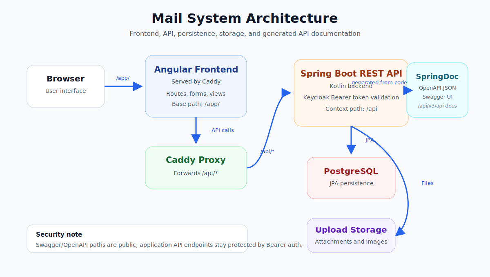
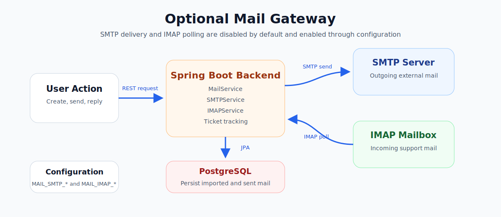
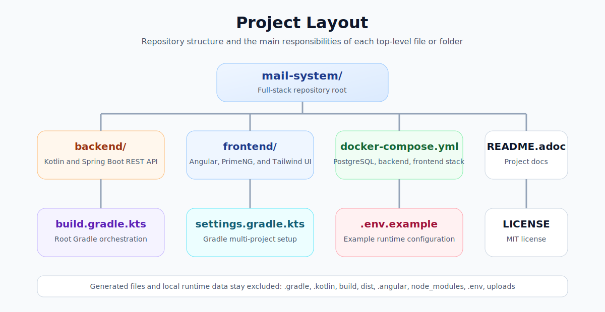

= THM Web Technologies Mail System
:toc:
:toclevels: 2
:sectanchors:

THM Web Technologies Mail System is a full-stack mail management application with a Kotlin/Spring Boot backend and an Angular frontend.
It supports authenticated users, internal mail workflows, draft handling, attachments, and an optional SMTP/IMAP gateway for external support mail.

== Features

* Keycloak OpenID Connect login with Authorization Code Flow and PKCE.
* Inbox, sent-mail, and draft views for authenticated users.
* Mail creation with TO, CC, BCC, Reply-To, and optional external recipient addresses.
* Draft creation, draft editing, sending, and deleting.
* File attachment upload, storage, and preview support.
* Optional SMTP delivery through a configurable shared mailbox.
* Optional IMAP polling for external support mail import.
* Support replies with ticket subject tracking.
* Development seed data for application profiles and example mails. Credentials are managed in Keycloak.
* Root Gradle build orchestration for frontend, backend, checks, and installable artifacts.

== Architecture

.System overview

.Optional mail gateway

The frontend is responsible for routing, forms, authenticated views, and user-facing mail actions.
The backend exposes the REST API, validates requests, enforces authentication, persists domain data, stores uploaded files, and integrates with external mail services when enabled.

Main backend modules:

* `security` validates Keycloak Bearer access tokens and protects application API routes.
* `user` manages application profile data linked to Keycloak subjects.
* `mail` manages drafts, sent mail, received support mail, replies, and ticket tracking.
* `mail_record` stores recipient metadata such as TO, CC, BCC, and Reply-To.
* `attachment` and `storage` store and serve uploaded files.
* `smtp` contains SMTP sending, IMAP import, and gateway configuration.

== Project Layout

.Repository structure

Generated files and local runtime data are intentionally excluded from the project:
`.gradle/`, `.kotlin/`, `build/`, `dist/`, `.angular/`, `node_modules/`, `.env`, and `uploads/`.

== Dependencies

=== Runtime and Tooling

* Java 21.
* Gradle wrapper 9.5.0.
* Docker and Docker Compose for the complete containerized setup.
* Node.js 24.12.0 and npm 11.6.2 for frontend builds. The Gradle frontend build downloads these automatically.
* PostgreSQL 17 in Docker Compose. The backend can also use its H2 fallback for simple local runs.

=== Backend

* Kotlin 2.2.21.
* Spring Boot 4.0.6.
* Spring Web MVC, Security, Data JPA, Validation, and Mail.
* SpringDoc OpenAPI for generated API documentation and Swagger UI.
* Spring OAuth2 Resource Server for Keycloak Bearer JWT validation.
* PostgreSQL JDBC driver.
* H2 database for fallback and tests.
* CycloneDX Gradle plugin for backend SBOM generation.
* ktlint for Kotlin style checks.

=== Frontend

* Angular 21.1.x.
* PrimeNG 21.1.1 and PrimeIcons.
* `angular-oauth2-oidc` for OpenID Connect Authorization Code Flow with PKCE.
* Tailwind CSS 4.1.18.
* RxJS.
* ESLint and Vitest for quality checks and tests.

== Configuration

Create a local `.env` file from the example before starting the Docker setup:

[source,bash]
----
cp .env.example .env
----

At minimum, review these values:

* `DB_USER`, `DB_PASSWORD`, `DB_NAME`, and `DB_URL` for database access.
* `OAUTH2_ISSUER_URI` and `OAUTH2_JWK_SET_URI` for Keycloak JWT validation.
* `SERVER_SERVLET_CONTEXT_PATH` for the REST API base path. It defaults to `/api`.
* `SPRINGDOC_*` to change or disable generated OpenAPI and Swagger UI endpoints.
* `FILE_UPLOAD_DIR` for uploaded attachment storage.
* `MAIL_CLIENT_PORT` for the exposed frontend port.
* `MAIL_SMTP_*`, `MAIL_IMAP_*`, and `MAIL_FROM_ADDRESS` if the external mail gateway should be enabled.

Keep real credentials in `.env` only. The `.env` file is ignored and must not be committed.

== Start the System

=== Docker Compose

Build the installable artifacts and start the full stack:

[source,bash]
----
./gradlew build
docker compose up --build -d
----

Open the frontend at `http://localhost:8081/app/`.

Default services:

* `database`: PostgreSQL.
* `keycloak`: Keycloak OpenID Connect identity provider.
* `mailserver`: Spring Boot backend.
* `mailclient`: Angular production build served by Caddy.

The REST API is reached through the frontend container at `/api/*`.
Caddy reverse proxies those calls to the internal backend service.

Stop the system with:

[source,bash]
----
docker compose down
----

Use `docker compose down -v` only when the database and upload volumes should be removed as well.

=== Local Development

Start the backend from the repository root:

[source,bash]
----
./gradlew :backend:bootRun
----

Start the frontend in a second terminal:

[source,bash]
----
cd frontend
npm install
npm run start
----

The Angular development server uses `frontend/proxy.conf.json` to forward `/api/**` requests to `http://localhost:8080`.
Keycloak is reached directly at `http://localhost:9080`.

== Identity Management

The application uses Keycloak as an OpenID Connect Identity Provider.
The Angular frontend is a public SPA client and uses Authorization Code Flow with PKCE through `angular-oauth2-oidc`.
The Spring Boot backend is an OAuth2 Resource Server and validates Keycloak Bearer access tokens.

Users enter credentials only in Keycloak.
The mail system does not store, hash, or verify local user passwords.
Application user rows only store profile data and an optional `external_subject` value that links the profile to the stable OIDC `sub` claim.

=== Keycloak Development Setup

Docker Compose starts Keycloak with:

[source,yaml]
----
keycloak:
  image: quay.io/keycloak/keycloak:26.6.3
  restart: unless-stopped
  environment:
    KC_BOOTSTRAP_ADMIN_USERNAME: admin
    KC_BOOTSTRAP_ADMIN_PASSWORD: admin
  command: start-dev
  ports:
    - "9080:8080"
  volumes:
    - kc-data:/opt/keycloak/data
----

Open the Keycloak admin console at `http://localhost:9080`.
Log in with username `admin` and password `admin`.

For local development, configure the realm, client, PKCE, HTTP-only dev SSL setting, and one demo user with:

[source,bash]
----
./scripts/configure-keycloak.sh
----

The script creates a Keycloak user `aallanson@example.com` with password `test1234`.
This is a Keycloak-only development credential; the mail system still does not store local user passwords.

Manual equivalent:

Create this realm:

* Realm name: `mail-system`

Create this client:

* Client type: OpenID Connect
* Client ID: `mail-client`
* Name: `Mail Client`
* Client authentication: Off
* Standard flow: On
* Require PKCE: On
* PKCE method: `S256`

Configure URLs for local Angular development and the Docker frontend:

* Root URL: `http://localhost:8081/`
* Home URL: `http://localhost:8081/`
* Valid redirect URIs: `http://localhost:4200`, `http://localhost:4200/*`, `http://localhost:8081`, `http://localhost:8081/app/`, `http://localhost:8081/*`
* Valid post logout redirect URIs: `http://localhost:4200`, `http://localhost:4200/*`, `http://localhost:8081`, `http://localhost:8081/app/`, `http://localhost:8081/*`
* Web origins: `+`

Use these scopes:

* `openid`
* `profile`
* `email`

For the seeded demo mail profiles, create matching Keycloak users with the same email addresses, for example `aallanson@example.com`.
On first login, the backend links the local application profile to the Keycloak `sub` claim.

== Development Workflow

Run all checks from the repository root:

[source,bash]
----
./gradlew check
----

Useful focused commands:

[source,bash]
----
./gradlew lint
./gradlew :backend:test
./gradlew :frontend:npmTest
./gradlew sbom
./gradlew clean
----

The SBOM command generates CycloneDX software bill of materials files for the Gradle backend dependencies and the npm frontend dependencies:

* Backend Gradle SBOM: `backend/build/reports/cyclonedx-direct/`
* Frontend npm SBOM: `frontend/build/reports/cyclonedx/bom.json`

Generate a readable local HTML report with:

[source,bash]
----
npm run sbom:report
open build/reports/sbom-report/index.html
----

The root `clean` task removes generated backend and frontend artifacts, including local frontend caches and `node_modules`.
Run `npm install` again before using frontend-only npm commands after a clean.

== Seed Application Profiles

The backend imports application profile and mail seed data from `backend/src/main/resources/data.json` when the database is empty.
These profiles do not contain credentials.
Create credentials in Keycloak instead.

[cols="1,2,2,3",options="header"]
|===
| #
| First name
| Last name
| Email

| 1
| Ameline
| Allanson
| `aallanson@example.com`

| 2
| Sanson
| Vardey
| `svardey1@example.com`

| 3
| Jami
| Poe
| `jpoe@example.uk`

| 4
| Trent
| Ianno
| `tianno3@example.com`

| 5
| Alikee
| Raisbeck
| `araisbeck4@example.com`
|===

== Mail Gateway

SMTP and IMAP integration is disabled by default.
Enable it through the `.env` file when a real mailbox should be used.

Outgoing mail uses the `MAIL_SMTP_*` variables.
Incoming external support mail uses the `MAIL_IMAP_*` variables and is imported as shared received mail.
Support replies are sent through the configured shared mailbox and keep a generated ticket number in the subject.

The example values target THM mail gateway defaults:

* SMTP over SSL on `mailgate.thm.de:465`.
* IMAP over SSL on `mailgate.thm.de:993`.

== API Overview

The API base path is configured as the servlet context path and defaults to `/api`.
SpringDoc generates the OpenAPI description from the running Spring implementation.

Documentation endpoints:

* `GET /api/v3/api-docs`
* `GET /api/swagger-ui/index.html`

These SpringDoc endpoints are intentionally excluded from Bearer authentication in the backend security configuration.
They can be moved or disabled with `SPRINGDOC_API_DOCS_*` and `SPRINGDOC_SWAGGER_UI_*` settings, for example in production.

Authenticated endpoints:

* `GET /api/users`
* `GET /api/users/me`
* `GET /api/users/{id}`
* `PUT /api/users/{id}`
* `DELETE /api/users/{id}`
* `GET /api/mails/incoming`
* `GET /api/mails/sent`
* `GET /api/mails/drafts`
* `GET /api/mails/{mailId}`
* `POST /api/mails`
* `PUT /api/mails/{mailId}`
* `DELETE /api/mails/{mailId}`
* `POST /api/mails/send`
* `POST /api/mails/send/{mailId}`
* `POST /api/mails/{mailId}/reply`
* `GET /api/images/{filename}`
* `GET /api/mail-gateway/incoming`

== License

This project is licensed under the MIT License.
See link:LICENSE[LICENSE] for the full license text.
